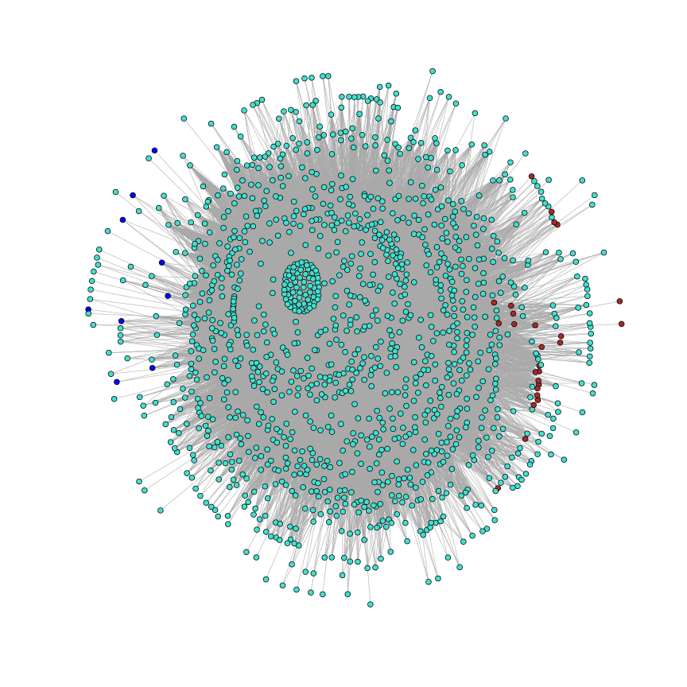
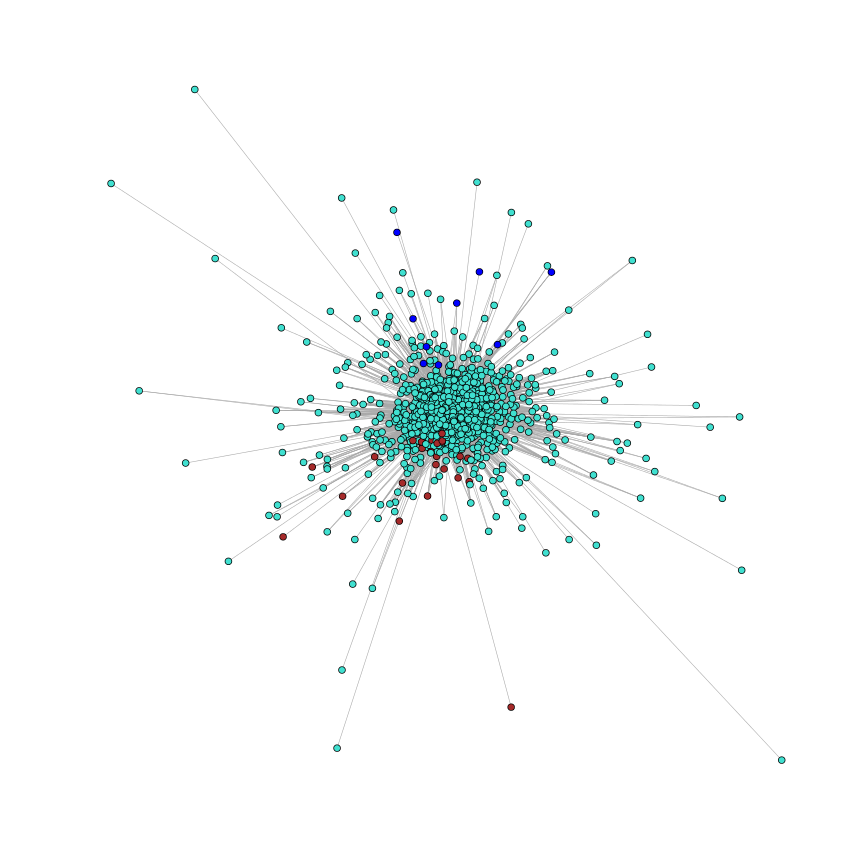
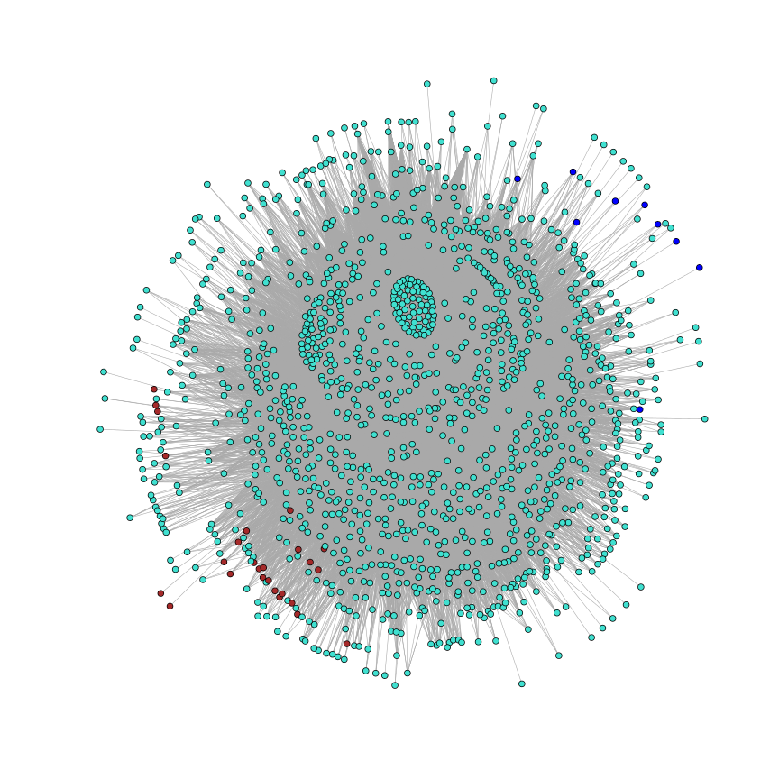

Co-expression Network Layout
============================
2013/09/30

Overview
--------

Setup
-----
First, let's convert the edge list that has been formatted for use with
Cytoscape into a format supported by igraph.


```r
# Knitr defaults
library(knitr)
opts_chunk$set(fig.width = 12, fig.height = 12, fig.dpi = 96)
```


```r
require(igraph)

# Load graph
g = read.graph("network.graphml", format = "graphml")
head(V(g)$name)
```

```
## [1] "Tc00.1047053397937.10" "Tc00.1047053397937.5"  "Tc00.1047053398345.10"
## [4] "Tc00.1047053398751.10" "Tc00.1047053399033.10" "Tc00.1047053399033.19"
```

```r
head(E(g))
```

```
## Edge sequence:
##                                                     
## [1] Tc00.1047053439307.9   -- Tc00.1047053403153.10 
## [2] Tc00.1047053487507.10  -- Tc00.1047053403153.10 
## [3] Tc00.1047053503811.10  -- Tc00.1047053403153.10 
## [4] Tc00.1047053503893.10  -- Tc00.1047053403153.10 
## [5] Tc00.1047053503909.84  -- Tc00.1047053403153.10 
## [6] Tc00.1047053504427.270 -- Tc00.1047053403153.10
```

```r

# To speed things up for now, let's limit ourselves to 100 vertices
num_keep = 2000
g = g - sample(V(g), length(V(g)) - num_keep)

# Let's remove any isolated vertices
g = g - names(degree(g)[degree(g) == 0])
```


First let's try plotting the network using the default layout

```r
plot(g, vertex.size = 2, vertex.label = NA)
```

 


Next, let's try plotting the same network but using force-directed layouts.


```r
# Fruchterman-Reingold
coords = layout.fruchterman.reingold(g, weights = E(g)$weight)
plot(g, layout = coords, vertex.size = 2, vertex.label = NA)
```

 

```r

# Kamada-Kawai
coords2 = layout.kamada.kawai(g, weights = E(g)$weight)
plot(g, layout = coords2, vertex.size = 2, vertex.label = NA)
```

 


Next, let's see what the effect of adjusting the edge weights is. Before doing
that, however, let's first look at the distribution of weights.


```r
hist(E(g)$weight, breaks = 15)
```

 


From the above histogram, it becomes apparent that the weights are all clustered
together around 0.6 - 0.65. This is due to the thresholding that was performed
on the original network data to reduce the number of edges before exporting:
in that case only edges >= 0.6 were kept.

First, let's try simply spreading the weights out over the range (0,1).


```r
w = E(g)$weight

scaled_weights = (w - min(w))/(max(w) - min(w))
hist(scaled_weights, breaks = 15)
```

 


Let's try using the new scheme on the same force-directed layout method
above.


```r
# Fruchterman-Reingold
coords3 = layout.fruchterman.reingold(g, weights = scaled_weights)
plot(g, layout = coords3, vertex.size = 2, vertex.label = NA)
```

 

```r

coords4 = layout.fruchterman.reingold(g, weights = scaled_weights * 100)
plot(g, layout = coords4, vertex.size = 2, vertex.label = NA)
```

 

```r

# Kamada-Kawai
coords5 = layout.kamada.kawai(g, weights = scaled_weights)
plot(g, layout = coords5, vertex.size = 2, vertex.label = NA)
```

 

```r

coords6 = layout.kamada.kawai(g, weights = scaled_weights * 100)
plot(g, layout = coords6, vertex.size = 2, vertex.label = NA)
```

 


