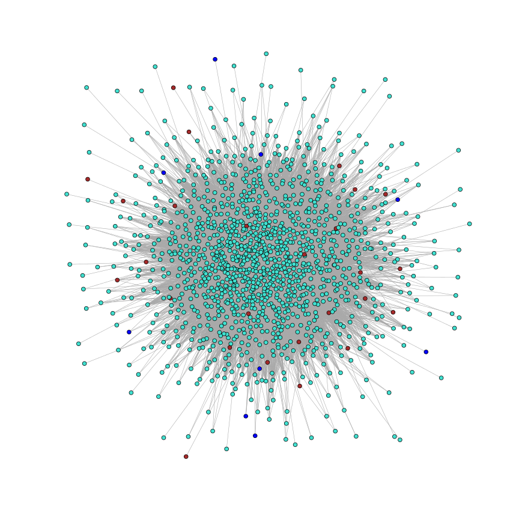
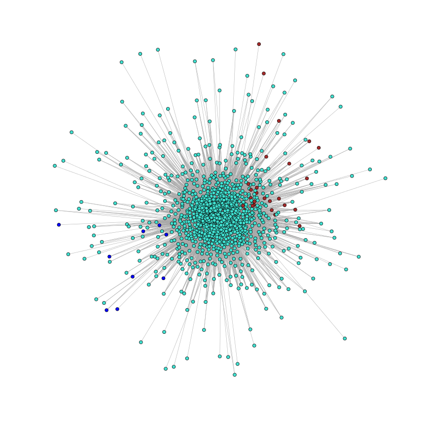
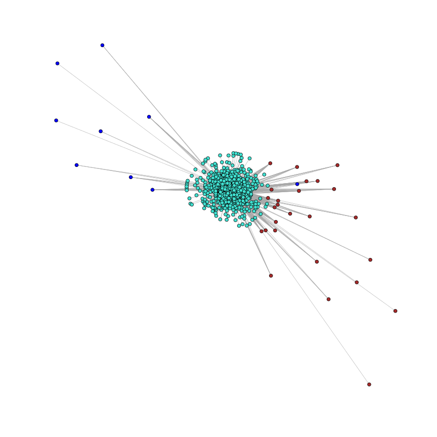

Co-expression Network Layout
============================
2013/09/30

Overview
--------

Setup
-----
First, let's convert the edge list that has been formatted for use with
Cytoscape into a format supported by igraph.


```r
# Knitr defaults
library(knitr)
opts_chunk$set(fig.width = 12, fig.height = 12, fig.dpi = 96)

# igraph defaults
igraph.options(vertex.size = 2, vertex.label = NA, edge.width = 0.75)
```


```r
require(igraph)

# Load graph
g = read.graph("network.graphml", format = "graphml")
head(V(g)$name)
```

```
## [1] "Tc00.1047053397937.10" "Tc00.1047053397937.5"  "Tc00.1047053398345.10"
## [4] "Tc00.1047053398751.10" "Tc00.1047053399033.10" "Tc00.1047053399033.19"
```

```r
head(E(g))
```

```
## Edge sequence:
##                                                     
## [1] Tc00.1047053439307.9   -- Tc00.1047053403153.10 
## [2] Tc00.1047053487507.10  -- Tc00.1047053403153.10 
## [3] Tc00.1047053503811.10  -- Tc00.1047053403153.10 
## [4] Tc00.1047053503893.10  -- Tc00.1047053403153.10 
## [5] Tc00.1047053503909.84  -- Tc00.1047053403153.10 
## [6] Tc00.1047053504427.270 -- Tc00.1047053403153.10
```

```r

# To speed things up for now, let's limit ourselves to 100 vertices num_keep
# = 6000 g = g - sample(V(g), length(V(g)) - num_keep)

# Let's remove any isolated vertices
g = g - names(degree(g)[degree(g) == 0])
```


First let's try plotting the network using the default layout

```r
plot(g)
```

 


Next, let's try plotting the same network but using force-directed layouts.


```r
# Fruchterman-Reingold
coords = layout.fruchterman.reingold(g, weights = E(g)$weight)
plot(g, layout = coords)
```

 

```r

# Kamada-Kawai
coords2 = layout.kamada.kawai(g, weights = E(g)$weight)
plot(g, layout = coords2)
```

 


Next, let's see what the effect of adjusting the edge weights is. Before doing
that, however, let's first look at the distribution of weights.


```r
hist(E(g)$weight, breaks = 15)
```

 


From the above histogram, it becomes apparent that the weights are all clustered
together around 0.6 - 0.65. This is due to the thresholding that was performed
on the original network data to reduce the number of edges before exporting:
in that case only edges >= 0.6 were kept.

First, let's try simply spreading the weights out over the range (0,1).


```r
w = E(g)$weight

scaled_weights = (w - min(w))/(max(w) - min(w))
hist(scaled_weights, breaks = 15)
```

 


Let's try using the new scheme on the same force-directed layout method
above.


```r
# Fruchterman-Reingold (standardized)
coords3 = layout.fruchterman.reingold(g, weights = scaled_weights)
plot(g, layout = coords3)
```

 

```r

# Fruchterman-Reingold (standardized * 100)
coords4 = layout.fruchterman.reingold(g, weights = scaled_weights * 100)
plot(g, layout = coords4)
```

 

```r

# Kamada-Kawai (standardized)
coords5 = layout.kamada.kawai(g, weights = scaled_weights)
plot(g, layout = coords5)
```

 

```r

# Kamada-Kawai (standardized * 100)
coords6 = layout.kamada.kawai(g, weights = scaled_weights * 100)
plot(g, layout = coords6)
```

 


Since it appears that vertices in the smaller modules are often less connected
to each other (even though the vertices are more similar to each other than
to vertices from other modules, because the edge weights were not necessarily
higher, there were filtered out during the thresholding step), let's try down-
weighting edges that cross modules. This should help to emphasize (somewhat
artificially) connections within a module.

@TODO: It might be worth scaling the edges based on module membership before
doing any thresholding: this way intermodules edges can be more heavily
pruned than intramodule edges.


```r
edge_list = get.edges(g, E(g))
mod_weights = scaled_weights

for (i in seq(1, length(mod_weights))) {
    e = get.edges(g, E(g)[i])
    
    # Same module
    if (V(g)[e[1]]$color == V(g)[e[2]]$color) {
        mod_weights[i] = mod_weights[i] + 10
    }
}

# Fruchterman-Reingold (module-adjusted weights)
coords7 = layout.fruchterman.reingold(g, weights = mod_weights)
plot(g, layout = coords7)
```

 

